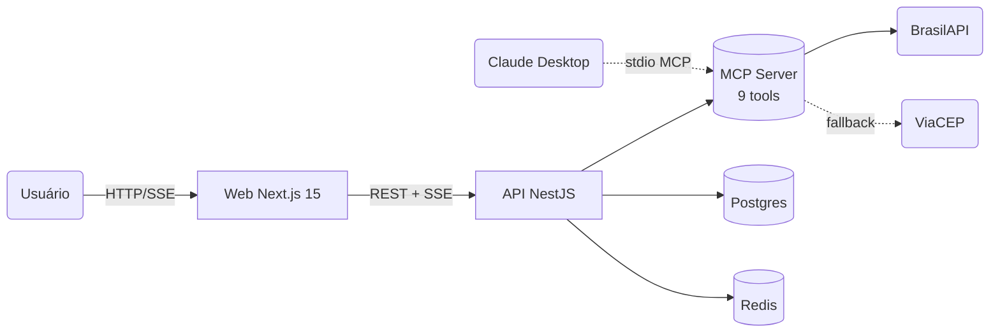

# Brazil Data — Assistente Contábil

[](https://github.com/MatheusTDjamdjian/brazil-data/actions/workflows/ci.yml)
[](#licença)
[](#pré-requisitos)
[](#pré-requisitos)

Assistente contábil que consulta dados públicos brasileiros (CNPJ, CEP, CNAE, Simples Nacional, banco, DDD, feriados, prazos fiscais) via servidor MCP, com **agente determinístico zero-LLM**.

**Custo por consulta = R$0,00**. Sem chave de API externa. **51 testes** entre unit/e2e + smoke real do protocolo MCP.

---

## Quickstart

```bash
git clone https://github.com/MatheusTDjamdjian/brazil-data.git
cd brazil-data
make up                    # ou: pnpm start
```

Em menos de 2 minutos: Postgres + Redis (Docker), API NestJS (`:3001`) e Web Next.js (`:3000`) no ar.

**Zero configuração obrigatória** — `.env` é opcional. Defaults batem com o `docker-compose.yml`.

### Pré-requisitos

- **Node** 20+ ([nodejs.org](https://nodejs.org))
- **pnpm** 9+ (`npm install -g pnpm`)
- **Docker** + Docker Compose v2 ([docker.com](https://docker.com))
- **GNU Make** (opcional — no Windows: `choco install make` ou WSL; sem make use `pnpm start`)

---

## Arquitetura em uma figura



Detalhe completo em [`docs/ARCHITECTURE.md`](./docs/ARCHITECTURE.md).

---

## Pacotes

| Pacote                    | Descrição                                                                                                                          | README                                |
| ------------------------- | ---------------------------------------------------------------------------------------------------------------------------------- | ------------------------------------- |
| `@brazil-data/mcp-server` | 9 ferramentas MCP em TypeScript (BrasilAPI/ViaCEP). Standalone via stdio (Claude Desktop) ou in-process                            | [📦](./packages/mcp-server/README.md) |
| `@brazil-data/api`        | NestJS: agente determinístico (regex/keywords → tool → Markdown PT-BR), `/chat` SSE, `/contabil/analise-empresa`, `/admin/metrics` | [📦](./packages/api/README.md)        |
| `@brazil-data/web`        | Next.js 15 (App Router) + Tailwind + shadcn primitives. Chat, ficha de empresa, dashboard, tema claro/escuro                       | [📦](./packages/web/README.md)        |

## Documentação

| Doc                                              | Conteúdo                                                                                  |
| ------------------------------------------------ | ----------------------------------------------------------------------------------------- |
| [`docs/ARCHITECTURE.md`](./docs/ARCHITECTURE.md) | Diagrama, sequência de request, estrutura de pastas, decisões de design                   |
| [`docs/MCP_TOOLS.md`](./docs/MCP_TOOLS.md)       | Spec completa das 9 tools (input, output, cache, exemplos, erros) + config Claude Desktop |
| [`docs/CONTABIL.md`](./docs/CONTABIL.md)         | Casos de uso contábeis com prompts reais e o que o agente devolve                         |
| [`docs/BENCHMARKS.md`](./docs/BENCHMARKS.md)     | Como rodar o benchmark de latência e interpretar os números                               |

---

## Por que zero-LLM?

Consultas contábeis têm padrões altamente estruturados (CNPJ, CEP, CNAE, banco). Um agente determinístico baseado em regex/keywords:

- **Custa R$0,00 por consulta** — sem tokens, sem chave de API.
- **Latência previsível** — só HTTP da BrasilAPI + cache local. Tipicamente **5-25 ms em cache hit**, 150-600 ms em cache miss.
- **100% reprodutível** — mesma pergunta → mesma resposta, sempre. Auditável.
- **Funciona offline** depois do cache aquecido.
- **Tudo isso roda em qualquer máquina com Docker**, sem cadastrar conta em provedor de LLM.

O preço: cobertura conversacional limitada às 9 intents previstas. Quando a pergunta sai do padrão, o agente responde com a lista de exemplos suportados — e o endpoint `/admin/metrics/unknown` mostra exatamente quais perguntas estão sendo perdidas, criando um feedback loop direto para evoluir o `IntentDetector`.

---

## Casos de uso (preview)

Cada exemplo abre no chat e dispara automaticamente:

| Caso contábil                    | Pergunta                                      | Intent            |
| -------------------------------- | --------------------------------------------- | ----------------- |
| Cadastro de cliente novo         | `Qual a situação do CNPJ 11.222.333/0001-81?` | `cnpj_lookup`     |
| Verificar regime tributário      | `O CNPJ ... é optante do Simples Nacional?`   | `simples_check`   |
| Calcular prazo de obrigação      | `15 dias úteis a partir de hoje`              | `prazo_fiscal`    |
| Endereço para nota fiscal        | `Endereço completo do CEP 01310-100`          | `cep_lookup`      |
| Pré-validar CPF antes da Receita | `O CPF 111.444.777-35 é válido?`              | `cpf_validate`    |
| Identificar atividade            | `Que atividade é o CNAE 6201-5/01?`           | `cnae_lookup`     |
| Banco por código COMPE           | `Qual o banco com código 237?`                | `banco_lookup`    |
| DDD desconhecido                 | `Quais cidades atendem o DDD 11?`             | `ddd_lookup`      |
| Calendário fiscal                | `Liste os feriados nacionais de 2026`         | `feriados_lookup` |

Mais detalhe em [`docs/CONTABIL.md`](./docs/CONTABIL.md). A ficha consolidada (com alertas) está em `/empresa/[cnpj]` ou pelo endpoint `POST /contabil/analise-empresa`.

---

## Conectar ao Claude Desktop

O `mcp-server` é um servidor MCP padrão; **qualquer cliente MCP** pode consumir as 9 tools via stdio JSON-RPC. Para Claude Desktop:

1. Build do servidor:

   ```bash
   pnpm --filter @brazil-data/mcp-server build
   ```

2. Em `claude_desktop_config.json` (macOS: `~/Library/Application Support/Claude/`, Windows: `%APPDATA%\Claude\`):

   ```json
   {
     "mcpServers": {
       "brazil-data": {
         "command": "node",
         "args": ["/caminho/absoluto/para/brazil-data/packages/mcp-server/dist/index.js"],
         "env": { "LOG_LEVEL": "info" }
       }
     }
   }
   ```

3. Reinicie o Claude Desktop. As 9 ferramentas aparecem disponíveis para o modelo.

Smoke real do protocolo:

```bash
pnpm --filter @brazil-data/mcp-server test:smoke
```

---

## Comandos

```
make help     # lista todos os comandos
make up       # sobe tudo (Docker + API + Web)
make down     # derruba containers
make logs     # logs dos containers
make reset    # apaga banco e refaz do zero (com seed)
make seed     # popula 5 conversas de exemplo (idempotente)
make test     # roda testes (Vitest + Jest)
make metrics  # snapshot do /admin/metrics/summary no terminal
make check    # valida pré-requisitos e .env
make build    # builda todos os pacotes
make lint     # lint em todo o monorepo
make format   # formata com Prettier
```

Tudo também disponível via `pnpm` (`pnpm start`, `pnpm test`, etc.) — útil em Windows sem make.

---

## Latência (números de referência)

Em máquina dev típica com Docker local (Node 20, Postgres 16, Redis 7):

| Operação                      | Latência típica | Notas                        |
| ----------------------------- | --------------: | ---------------------------- |
| `validar_documento`           |     **5-15 ms** | algoritmo local, sem rede    |
| Cache hit (qualquer intent)   |    **10-25 ms** | Redis + DB, sem HTTP externo |
| `consultar_cep` (cache miss)  |      150-400 ms | depende da BrasilAPI         |
| `consultar_cnpj` (cache miss) |      200-600 ms | payload maior                |
| `unknown` / `help`            |         5-15 ms | resposta estática            |

Rode o benchmark você mesmo: `pnpm tsx scripts/benchmark.ts` (com a API no ar). Detalhe em [`docs/BENCHMARKS.md`](./docs/BENCHMARKS.md).

---

## Testes

- **MCP server**: 70 testes Vitest cobrindo as 9 tools + lib (cache, http retry, documents, rateLimit). Cobertura ≥ 70% (statements + functions + branches + lines).
- **API**: 34 unit (Jest) + 17 e2e (Jest com fakes de Prisma e Mcp). Cobre o pipeline inteiro do agente, cache de resposta, conversas, métricas, contábil, health, validação de input.
- **MCP stdio**: smoke real spawnando `dist/index.js` e validando `initialize` → `tools/list` → `tools/call`.

Roda em CI Linux / Node 20 via [GitHub Actions](./.github/workflows/ci.yml).

---

## Roadmap

- [x] **Onda 1** — Fundação + DX (monorepo, Docker, scripts, Makefile, validação de env)
- [x] **Onda 2** — MCP server completo: 9 ferramentas, 70 testes Vitest, smoke stdio JSON-RPC, cobertura 78%
- [x] **Onda 3a** — API NestJS + agente determinístico zero-LLM (IntentDetector + ResponseFormatter), `/chat` SSE, `/health`, Prisma+Postgres, 9 intents cobertas
- [x] **Onda 3b** — Cache de resposta (Redis lazy + in-memory fallback), `GET /conversations`, `GET /admin/metrics/{summary,intents,unknown}`
- [x] **Onda 3c** — `POST /contabil/analise-empresa` (ficha + 7 alertas), `DELETE /admin/cache`, `/health` checa cache, seed idempotente. **51 testes (34 unit + 17 e2e)**
- [x] **Onda 4a** — Frontend Next.js 15: landing + `/chat` SSE consumer com Markdown, badges, primitives shadcn
- [x] **Onda 4b** — Domínio rico: `EmpresaCard` + `SociosTable` + `AlertasList`, `/empresa[/cnpj]` (server-rendered), `/conversations[/id]`, auto-send via `?q=`
- [x] **Onda 4c** — Dashboard `/admin/metrics` (summary + bars + unknowns), tema claro/escuro, HealthIndicator, skeletons, 404 global. **8 rotas, 122 kB max**
- [x] **Onda 5a** — Documentação técnica (`ARCHITECTURE.md`, `MCP_TOOLS.md`, `CONTABIL.md`) + README por pacote
- [x] **Onda 5b** — CI GitHub Actions + mensagens de erro polidas + script de benchmark
- [x] **Onda 5c** — Polimento final do README (este aqui)

---

## Stack

| Camada      | Tecnologia                                                    |
| ----------- | ------------------------------------------------------------- |
| MCP Server  | TypeScript ESM + `@modelcontextprotocol/sdk` + Zod + Vitest   |
| API         | NestJS 10 + Prisma 6 + PostgreSQL 16 + Jest                   |
| Agente      | Zero-LLM: regex/keywords (`IntentDetector`) + templates PT-BR |
| Frontend    | Next.js 15 (App Router) + Tailwind 3 + shadcn primitives      |
| Cache       | Redis lazy import + in-memory fallback (2 camadas)            |
| Infra local | Docker Compose (Postgres 16 + Redis 7)                        |
| Monorepo    | pnpm 10 workspaces                                            |
| CI          | GitHub Actions (Linux / Node 20)                              |

---

## Licença

[MIT](./LICENSE) — uso livre, comercial inclusive.
