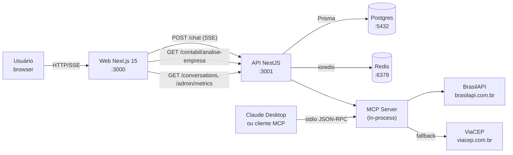
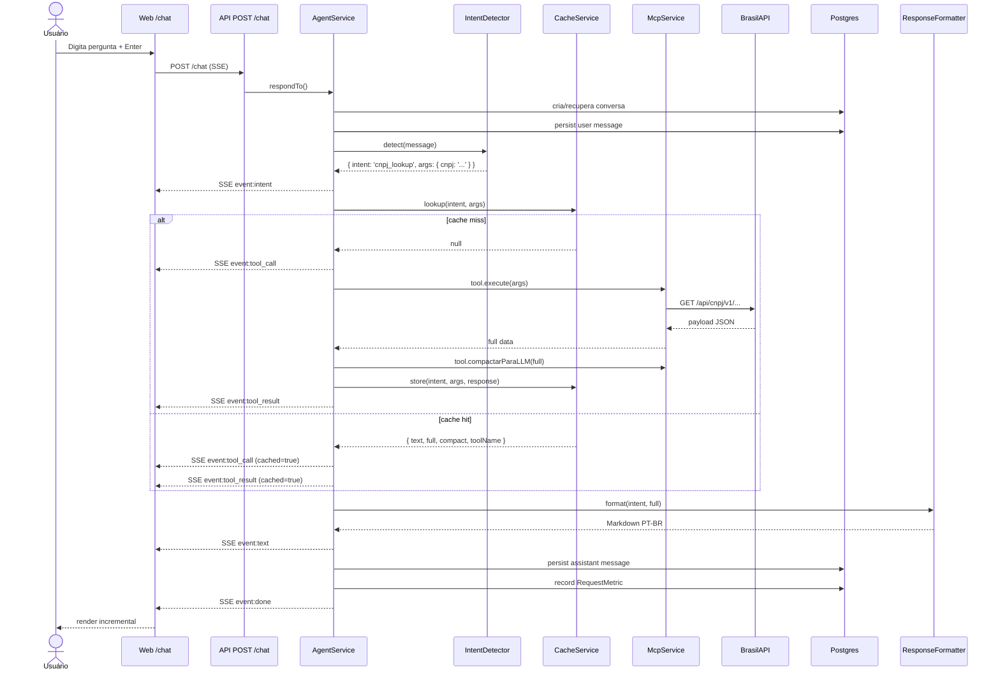

# Arquitetura

> Visão técnica do monorepo `brazil-data`. Para o pitch e quickstart, veja o [README raiz](../README.md). Para a especificação detalhada das ferramentas, [`MCP_TOOLS.md`](./MCP_TOOLS.md). Para casos de uso contábeis, [`CONTABIL.md`](./CONTABIL.md).

## Diagrama de alto nível



Os três pacotes do monorepo:

- **`@brazil-data/mcp-server`** — ESM puro. Expõe 9 ferramentas via SDK oficial do Model Context Protocol. Funciona standalone (Claude Desktop pode consumir via stdio) **e** in-process (a API importa as tools como library).
- **`@brazil-data/api`** — NestJS CJS. Orquestrador zero-LLM: regex/keywords → tool MCP → formato Markdown PT-BR. Persistência em Postgres (conversas + métricas) e cache em Redis (resposta final).
- **`@brazil-data/web`** — Next.js 15 (App Router). Chat com SSE, ficha consolidada de empresa, histórico de conversas, dashboard de métricas. Server components quando dá, client components quando precisa de localStorage.

## Fluxo de uma requisição típica

Cenário: usuário pergunta `"Qual a situação do CNPJ 11.222.333/0001-81?"` na `/chat`.



## Estrutura de diretórios

```
brazil-data/
├── packages/
│   ├── mcp-server/              # ESM, @modelcontextprotocol/sdk
│   │   ├── src/
│   │   │   ├── index.ts         # entry stdio + re-exports
│   │   │   ├── server.ts        # createMcpServer
│   │   │   ├── tools/           # 9 ferramentas
│   │   │   ├── providers/       # brasilApi, viaCep
│   │   │   └── lib/             # logger, cache, rateLimit, http, documents
│   │   └── tests/               # Vitest (70 testes)
│   ├── api/                     # NestJS, CJS
│   │   ├── prisma/              # schema + seed
│   │   ├── src/
│   │   │   ├── common/          # PrismaModule, CacheModule, env, logger
│   │   │   └── modules/
│   │   │       ├── agent/       # AgentService + IntentDetector + ResponseFormatter
│   │   │       ├── chat/        # SSE controller
│   │   │       ├── mcp/         # McpService (dynamic import do pacote MCP)
│   │   │       ├── metrics/     # /admin/metrics/{summary,intents,unknown}
│   │   │       ├── conversations/
│   │   │       ├── contabil/    # /contabil/analise-empresa
│   │   │       ├── health/
│   │   │       └── admin/       # DELETE /admin/cache
│   │   └── test/                # Jest (17 e2e)
│   └── web/                     # Next.js 15 App Router
│       └── src/
│           ├── app/             # routes
│           ├── components/      # ChatInterface, EmpresaCard, etc.
│           └── lib/             # api client, types, utils
├── scripts/
│   ├── start.ts                 # orquestrador (7 passos)
│   ├── check-prereqs.ts
│   ├── check-env.ts
│   └── help.mjs
└── docs/                        # ARCHITECTURE.md, MCP_TOOLS.md, CONTABIL.md
```

## Decisões de arquitetura

### 1. Zero-LLM por design

O agente **não usa modelo de linguagem**. A primeira versão tinha esse plano (sistema prompt curto, prompt caching, roteamento haiku/sonnet), mas o projeto pivotou para um agente puramente heurístico:

- **IntentDetector**: regex/keywords priorizadas (CNPJ+simples > CNPJ sozinho > CEP > CPF+keyword > CNAE > DDD > banco > feriados > prazo > help/unknown).
- **ResponseFormatter**: templates Markdown PT-BR por intent.
- **Resultado**: custo $0 por consulta, latência previsível, 100% reprodutível.

O preço é uma cobertura conversacional limitada às 9 intents previstas. O dashboard `/admin/metrics/unknown` é o sinal pra evoluir o `IntentDetector` — cada query que cai em `unknown` é cobertura perdida e candidata a pattern novo.

### 2. MCP server consumido in-process

A api importa `@brazil-data/mcp-server` via `await import()` (dinâmico, porque o pacote é ESM e o NestJS é CJS). Cada ferramenta expõe:

- `execute(input)` → versão completa (persistida + UI)
- `compactarParaLLM(full)` → versão enxuta (originalmente para LLM, hoje serve de payload de histórico/log)

O **mesmo pacote** pode ser usado como MCP server standalone via stdio — Claude Desktop conecta e usa as 9 tools sem mudar uma linha.

### 3. Cache em duas camadas

- **Nas tools (MCP server)**: cada tool tem TTL próprio (24h CNPJ, 7d CEP, 30d banco/DDD/CNAE, 90d feriados). In-memory por default, Redis quando `REDIS_URL` está setado.
- **Na API (CacheService)**: cache da resposta final do agente, chave = `sha256(intent + args_sorted)`. Hit = SSE replay com `cached:true`, zero chamadas HTTP/Prisma extra (exceto persist da mensagem e da métrica).

### 4. Persistência mínima

Quatro modelos Prisma:

- `Conversation` (id, userId, title, timestamps)
- `Message` (role, content em Markdown, toolCalls JSON)
- `EmpresaCache` (placeholder pra futuros caches persistidos de CNPJ — não usado em runtime ainda)
- `RequestMetric` (intent, toolName, cached, durationMs, userMessage, timestamps)

`db push` é usado em vez de `migrate dev` durante desenvolvimento pra reduzir fricção (sem migration files pra commitar). Em produção real, recomenda-se `migrate deploy`.

### 5. Server-side rendering oportunista

- `/empresa/[cnpj]` é **server component**: faz `fetch` direto pro API, HTML pronto chega no browser. Bom pra SEO e percepção de performance.
- `/conversations` e `/conversations/[id]` são **client components** porque precisam do `X-User-Id` lido do `localStorage`.
- `/admin/metrics` é client pra permitir refresh sem reload.
- `/chat` é dynamic (lê `searchParams.q` no server, passa para o ChatInterface client).

### 6. Sem chave de API obrigatória, sem .env obrigatório

Defaults do `EnvSchema` casam com o `docker-compose.yml`. A primeira execução pode ser:

```bash
git clone ...
cd brazil-data
make up
```

Zero passos de configuração. Quando o usuário precisa customizar (DATABASE_URL pra Postgres externo, etc.), `.env` é lido e merge com defaults.

## Por que não testes integrados em CI?

Os testes do mcp-server (70 Vitest) e os e2e da api (17 Jest) usam **fakes** em vez de Postgres real e BrasilAPI real:

- `FakeMcpService` substitui o pacote MCP no contexto Jest CJS (evita ESM/CJS conflict)
- `FakePrismaService` é um in-memory store que implementa só os métodos usados
- `globalThis.fetch` é mockado por handler matching no e2e

Isso torna o pipeline rápido (e2e em ~15s, unit em ~30s) e portável (zero deps externas). Smoke real do MCP stdio é feito via `tests/smoke-mcp.mjs` no pacote `mcp-server`.
